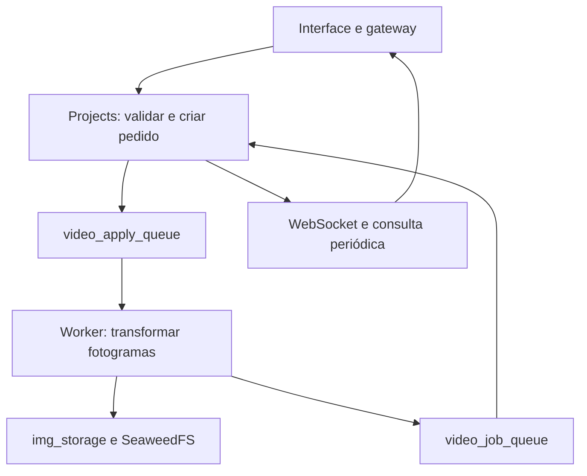

# UC-VID-003 — Aplicar ferramentas a todos os fotogramas

Implementação do MVP sobre `main` no commit `9cc2bc1`, com importação e recorte já integrados. Referência: UC-VID-003 e REQ-VID-APPLY-001 a 026 de [RAS-exercicio_1_2_entrega_grupo_3UC.md](RAS-exercicio_1_2_entrega_grupo_3UC.md). Esta alteração implementa o caso de uso; não altera a atribuição de autores na especificação.

## Utilização

1. Iniciar a aplicação com `docker compose up -d --build`, entrar numa conta gratuita ou Premium e importar um vídeo para um projeto.
2. No vídeo disponível, abrir **Ferramentas de vídeo → Aplicar ferramentas**.
3. Adicionar entre uma e três ferramentas, preencher os parâmetros e ordenar com as setas. A interface mostra a resolução final e impede parâmetros inválidos.
4. Selecionar **Aplicar ferramentas**. O pedido fica **Em fila**; o progresso e os fotogramas processados aparecem em **Pedidos deste vídeo**.
5. Quando estiver **Concluído**, abrir o novo vídeo na biblioteca ou selecionar **Exportar**. **Cancelar** está disponível enquanto o pedido estiver em fila ou em processamento.

O resultado usa `{nome}_editado.ext`. Havendo colisões, são acrescentados `_2`, `_3`, etc. Os nomes de pedidos ativos também contam. O ficheiro original é apenas lido.

| Regra de APPLY | Gratuito (`free`) | Premium |
|---|---:|---:|
| Duração máxima de entrada | 120 s | 600 s |
| Tamanho máximo de entrada | 200 × 1024² bytes | 2 × 1024³ bytes |
| Resolução final máxima | largura 1920, altura 1080 | largura 3840, altura 2160 |
| Pedidos ativos de vídeo, incluindo TRIM | 1 | 3 |
| Operações diárias | 5, partilhadas com imagem | Sem limite |

A cadeia completa conta uma operação. A implementação reserva-a no envio e devolve-a se o pedido falhar ou for cancelado. O contador pode mostrar a reserva durante o processamento. A importação mantém os seus próprios limites, que são maiores; importar um vídeo não garante que possa ser editado com APPLY.

Os limites de resolução são aplicados literalmente à largura e altura **finais**, conforme a especificação. Rodar um vídeo de 1920 × 1080 para 1080 × 1920 excede a altura gratuita; é possível acrescentar um redimensionamento para ficar dentro do limite. As ferramentas intermédias podem ter até 3840 px em cada dimensão.

## Componentes e fluxo



- `frontend/components/project-page/video-apply-panel.tsx`: cadeia, parâmetros, ordenação, validação e envio. `video-tools-dialog.tsx` apresenta tanto TRIM como APPLY e os respetivos pedidos.
- `frontend/lib/video-apply.ts`: tipos e regras da interface; `video-jobs.ts` distingue os parâmetros dos dois tipos de trabalho. A biblioteca e a quota são atualizadas também quando o estado final chega por consulta periódica, sem evento WebSocket.
- `apiGateway/routes/videos.js`: nova rota, com o mesmo controlo JWT do restante vídeo.
- `projects/utils/videoApply.js`: regras autoritativas de APPLY. `routes/videoJobs.js` mantém os contratos de TRIM e acrescenta o envio da cadeia.
- `projects/utils/videoJobs.js`: publicação, progresso, resultados, cancelamento, falhas e quota partilhados. A publicação usa confirmação do broker; as respostas só recebem `ack` depois das escritas na base de dados.
- `Tools/video_apply`: novo worker. O processo principal serve os heartbeats, envia progresso e consulta o estado a cada dois segundos; um processo filho faz download, transformação e upload. Assim, uma operação de vídeo ou rede demorada não ocupa o ciclo de comunicação.
- `Tools/utils/image_operations.py`: funções Pillow extraídas das ferramentas de imagem existentes. Os workers de redimensionamento, binarização e rotação usam as mesmas funções que o vídeo.

### Processamento

O worker descodifica o primeiro fluxo de vídeo e transforma todos os fotogramas com Pillow, pela ordem da cadeia. Copia os tempos de apresentação e duração dos fotogramas; preserva o codec de vídeo e o contentor. As faixas de áudio são copiadas como pacotes comprimidos, sem passagem pelo codificador de áudio.

H.264 usa `libx264`; HEVC usa `libx265`; ProRes usa `prores_ks`. Para outros codecs MOV é solicitado um codificador do mesmo codec. Se não existir, ou se o contentor não conseguir representar o resultado, o pedido falha com a mensagem prevista e devolução da reserva. A transformação de pixels implica recodificar vídeo; não implica igualdade binária da faixa de vídeo.

Resultados H.264 com dimensões ímpares usam um formato de píxeis sem subamostragem que exija dimensões pares. A dimensão pedida é preservada, mas a reprodução de H.264 4:4:4 e de certos codecs MOV depende do browser. Preferir dimensões pares e MP4 H.264 para a demonstração; a compatibilidade de reprodução continua na checklist manual.

O resultado é escrito num diretório temporário e só é enviado após conclusão e inspeção. Cancelamento ou falha termina o filho e remove o diretório. Se o ficheiro já foi enviado, o worker ou o serviço de resultados remove-o. Uma resposta repetida de um pedido concluído preserva o vídeo existente. O tamanho real é verificado ao guardar na biblioteca, porque a recodificação pode aumentar o ficheiro.

### Quota e recuperação

O contrato de devolução do serviço `users` passa a aceitar `{jobId, day}` para trabalhos de vídeo. O identificador impede devoluções repetidas; o dia permite devolver a operação ao dia da reserva, mesmo depois da meia-noite. A alteração do contador e o registo da devolução usam uma única atualização do documento do utilizador. O contrato de imagem com corpo vazio continua disponível.

Trabalhos falhados/cancelados com uma devolução pendente são tentados novamente pela manutenção, de minuto a minuto. Pedidos sem atualizações durante 20 minutos falham; o worker tem um limite de 15 minutos, configurável em `VIDEO_APPLY_TIMEOUT`.

O MVP usa uma única instância de `projects`: o bloqueio por utilizador é local ao processo. Escalar várias instâncias exige reservas/bloqueios persistentes. O serviço legado de quota ainda reserva por `GET` sem chave de idempotência e pode ter corridas com operações de imagem; uma falha de rede exatamente durante a reserva ou uma falha simultânea de criação do pedido e compensação precisam de tratamento adicional antes de produção. Estas limitações não são apresentadas como resolvidas pelos testes com adaptadores.

## Contrato HTTP

Via gateway, com `Authorization: Bearer <JWT do dono>`:

```http
POST /projects/:user/:project/videos/:video/apply
Content-Type: application/json
```

```json
{
  "tools": [
    { "type": "resize", "width": 1280, "height": 720 },
    { "type": "binarization", "threshold": 128 },
    { "type": "rotate", "degrees": 180 }
  ]
}
```

Resposta `202 {job}`. A cadeia é armazenada na ordem recebida em `job.params.tools`; o resultado previsto em `job.params.width/height`. `frames_processed` começa em zero e `frame_count` pode ser `null` até o contentor ou processamento permitir conhecer o total.

Os pedidos reutilizam `GET /projects/:user/:project/video-jobs`, `GET /projects/:user/:project/video-jobs/:job` e `POST /projects/:user/:project/video-jobs/:job/cancel`. Os erros têm `{code, message}`. Valores fora das regras não chegam ao worker nem reservam quota.

## Verificação e entrega

Resultados executados pelo assistente: [resultados](../tests/uc-vid-003/resultados.md). Procedimento de verificação no ambiente completo: [checklist manual](../tests/uc-vid-003/checklist-manual.md). Registo de decisões e assistência: [registo-ia-apply.md](registo-ia-apply.md).

Não se declara validação manual pelo aluno, execução do Compose, medições dos requisitos de tempo em ambiente completo, nem compatibilidade de reprodução em browsers. Essas verificações devem ser registadas após execução.
